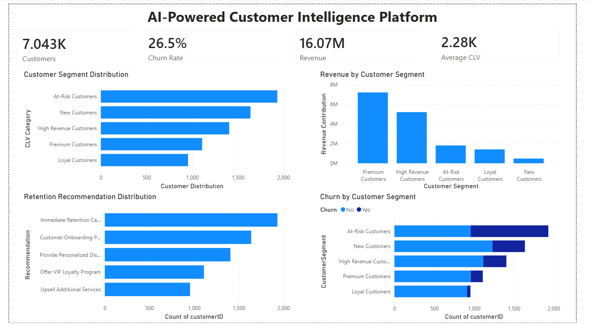

# AI-Powered Customer Intelligence Platform

## Overview

The AI-Powered Customer Intelligence Platform is an end-to-end machine learning and business intelligence solution designed to help organizations understand customer behavior, predict churn, estimate customer lifetime value (CLV), segment customers, and generate retention recommendations.

The project combines Machine Learning, Explainable AI, Customer Analytics, and Power BI dashboards to provide actionable business insights.

---

## Features

### Customer Churn Prediction
- Built Random Forest and XGBoost models
- Predicts customers likely to churn
- Evaluated using Accuracy, Precision, Recall, F1-Score, and ROC-AUC

### Explainable AI
- SHAP Summary Plot
- SHAP Feature Importance Analysis
- Model interpretability for business users

### Customer Segmentation
- K-Means Clustering
- Identifies customer groups based on behavior
- Segment-based business strategies

### Customer Lifetime Value (CLV)
- Predicts customer value
- Categorizes customers into:
  - Low Value
  - Medium Value
  - High Value
  - Premium Value

### Retention Recommendation Engine
- Generates retention strategies
- Supports customer loyalty and churn reduction

### Power BI Dashboard
Executive dashboard containing:

- Total Customers
- Revenue
- Average CLV
- Churn Rate
- Customer Segment Distribution
- Revenue Contribution by Segment
- Retention Recommendation Distribution
- Churn Analysis by Customer Segment

---

## Technology Stack

### Programming Language
- Python

### Machine Learning
- Scikit-Learn
- XGBoost

### Data Analysis
- Pandas
- NumPy

### Data Visualization
- Matplotlib
- Seaborn

### Explainable AI
- SHAP

### Business Intelligence
- Power BI

---

## Project Structure

```text
AI-Customer-Intelligence-Platform/
│
├── dashboard/
│   └── AI_Customer_Intelligence_Dashboard.pbix
│
├── data/
│   ├── processed/
│   └── final/
│
├── models/
│
├── notebooks/
│   ├── 01_data_loading.ipynb
│   ├── 02_data_cleaning.ipynb
│   ├── 03_eda.ipynb
│   ├── 04_feature_engineering.ipynb
│   ├── 05_churn_prediction.ipynb
│   ├── 06_explainable_ai.ipynb
│   ├── 07_customer_segmentation.ipynb
│   ├── 08_retention_recommendation_engine.ipynb
│   ├── 09_clv_prediction.ipynb
│   └── 10_business_analytics.ipynb
│
├── README.md
└── requirements.txt
```

---

## Machine Learning Results

### Random Forest

- Accuracy: 77.5%
- Precision: 59.5%
- Recall: 48.4%
- F1 Score: 53.4%
- ROC-AUC: 0.80

### XGBoost

- Accuracy: 79.3%
- Precision: 65.3%
- Recall: 47.3%
- F1 Score: 54.9%
- ROC-AUC: 0.84

XGBoost achieved the best overall performance.

---
## Dashboard

The Power BI Executive Dashboard provides an interactive view of customer behavior, revenue performance, churn analysis, customer lifetime value (CLV), and retention strategies.

### Dashboard Highlights

- Total Customers: 7,043
- Revenue: 16.07M
- Average CLV: 2.28K
- Churn Rate: 26.5%

### Visualizations Included

- Customer Segment Distribution
- Revenue Contribution by Customer Segment
- Churn Analysis by Customer Segment
- Customer Distribution by CLV Category
- Retention Recommendation Distribution

### Dashboard Preview



### Key Business Insights

- At-Risk Customers represent the largest customer segment requiring immediate retention efforts.
- Premium and High-Revenue customers contribute the highest revenue.
- Churn is significantly higher among At-Risk and New Customers.
- Retention recommendations help prioritize customer engagement strategies.
- Customer segmentation enables targeted marketing and business decision-making.

---

## Future Improvements

- Streamlit Web Application
- Real-Time Customer Monitoring
- Automated Recommendation System
- Cloud Deployment
- API Integration

---
## Impact

This project demonstrates how Artificial Intelligence, Machine Learning, Explainable AI, and Business Intelligence can work together to transform raw customer data into actionable business insights.

By combining churn prediction, customer segmentation, customer lifetime value analysis, retention recommendations, and interactive Power BI dashboards, the platform enables organizations to make data-driven decisions that improve customer retention, increase revenue, and enhance customer experience.

This project reflects the complete analytics lifecycle—from data preprocessing and feature engineering to predictive modeling, explainable AI, and executive-level business reporting.

---

## Key Achievements

✅ Built an end-to-end AI-powered customer analytics solution

✅ Achieved strong churn prediction performance using XGBoost (ROC-AUC: 0.84)

✅ Implemented Explainable AI using SHAP for model transparency

✅ Performed customer segmentation using K-Means clustering

✅ Developed Customer Lifetime Value (CLV) analysis and categorization

✅ Generated intelligent retention recommendations

✅ Designed an executive Power BI dashboard for business stakeholders

---


## Author

Nithya Sree

AI | Machine Learning | Data Analytics | Power BI
*"Turning data into intelligence and intelligence into business value."*